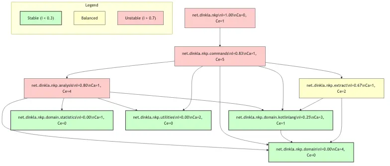
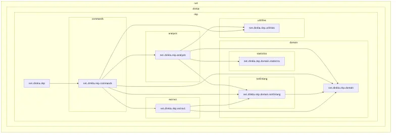
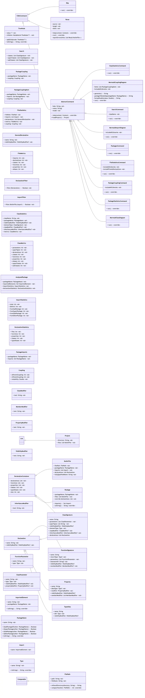

# kotlin-nkp

Kotlin-NKP is a static analysis tool for Kotlin programs (nkp stands for aNalysis of Kotlin Programs). 

## Introduction

**nkp** helps you understand and assess the architecture and structure of your Kotlin codebase by analyzing package dependencies, class hierarchies, and import relationships. It generates metrics and visual diagrams that aid in architectural decision-making, identifying coupling issues, and planning refactoring efforts.

### How to Use nkp

1. **Parse your project** - Convert your Kotlin source code into an analyzable JSON model
2. **Generate metrics** - Calculate package coupling, class statistics, and file-level metrics
3. **Visualize dependencies** - Create Mermaid diagrams showing class hierarchies, import flows, and package coupling
4. **Analyze architecture** - Use the metrics to identify unstable packages, high coupling, and architectural issues

### Use Cases

- **Architectural Assessment**: Understand package structure and dependencies in your codebase
- **Refactoring Planning**: Identify unstable packages and high coupling that need attention
- **Documentation**: Generate visual diagrams of your code structure
- **Code Review**: Get insights into package organization and dependencies
- **Migration Planning**: Understand dependencies before large-scale refactoring

## Capabilities

| Capability | Supported | Not Supported |
|-----------|----------|---------------|
| **Architectural Analysis** |
| Package dependency analysis | ✅ | |
| Package coupling metrics (Ca, Ce, I) | ✅ | |
| Import dependency tracking | ✅ | |
| Class hierarchy analysis | ✅ | |
| **Code Quality Metrics** |
| Class-level statistics | ✅ | |
| File-level statistics | ✅ | |
| Cyclomatic complexity | | ❌ |
| Lines of code metrics | | ❌ |
| Code duplication detection | | ❌ |
| **Dependency Analysis** |
| Package import relationships | ✅ | |
| Class inheritance trees | ✅ | |
| Circular dependency detection | | ❌ |
| Unused import detection | | ❌ |
| Dependency distance metrics | | ❌ |
| **Visualization** |
| Mermaid class diagrams | ✅ | |
| Mermaid import flow diagrams | ✅ | |
| Mermaid coupling diagrams | ✅ | |
| **Temporal Analysis** |
| Change frequency analysis | | ❌ |
| Historical metric trends | | ❌ |
| **Code Smells** |
| Large class detection | | ❌ |
| Long method detection | | ❌ |
| Deep inheritance detection | | ❌ |

**Summary**: nkp excels at **architectural and structural analysis** (package coupling, dependencies, class hierarchies) but does not provide **code quality metrics** (complexity, size, code smells) or **temporal analysis** (change history, trends).

## Features

You can run the program with `bin/nkp.sh` or with `just run`.

```shell
$ bin/nkp.sh -h 
Usage: nkp [<options>] <command> [<args>]...

Options:
  -v, --version  Show the version and exit
  -h, --help     Show this message and exit

Commands:
  parse                     Parse a source directory and generate a model file.
  class-statistics          Class statistics
  file-statistics           File statistics and imports report
  mermaid-class-diagram     Mermaid class diagram
  mermaid-coupling-diagram  Generate a Mermaid coupling diagram from code analysis
  mermaid-import-diagram    Mermaid import diagram
  package-coupling          Generate package coupling metrics
  package-statistics        Package statistics
  packages                  Packages report
  search                    Search for a class by name
```

## Installation

### Prerequisites

- Java 17+ (for building dependencies)
- Gradle (included via wrapper)
- [just](https://github.com/casey/just) (optional, for convenience commands)
- [ktlint](https://github.com/pinterest/ktlint) (optional, for code formatting)

### Build Dependencies

This project uses custom libraries to parse Kotlin source code. You need to build these first:

- https://github.com/Kotlin/grammar-tools
- https://github.com/Kotlin/kotlin-spec

Run the installation script:

```sh
$ bin/install-libs.sh
```

**Note:** The installation script requires Java 17. The project itself targets JVM 21.

### Optional Tools

- [mermaid-cli](https://github.com/mermaid-js/mermaid-cli) - useful for converting Mermaid diagrams to SVG/HTML

## Usage

The first step is to parse the files in a directory to a JSON file.

```sh
$ bin/nkp.sh parse /repositories/ray-tracer-challenge/src/main/kotlin generated/model.json
```

Use this JSON file in the analysis steps as input.

### Examples

Generate a Mermaid class diagram:
```sh
$ bin/nkp.sh mermaid-class-diagram generated/model.json > generated/class-diagram.mermaid
```

Generate statistics:
```sh
$ bin/nkp.sh class-statistics generated/model.json > generated/class-statistics.json
$ bin/nkp.sh file-statistics generated/model.json > generated/file-statistics.json
$ bin/nkp.sh file-statistics --include-private-declarations generated/model.json > generated/file-statistics-full.json
$ bin/nkp.sh package-statistics generated/model.json > generated/package-statistics.json
```

Generate diagrams:
```sh
$ bin/nkp.sh mermaid-import-diagram generated/model.json > generated/import-diagram.mermaid
$ bin/nkp.sh mermaid-import-diagram --include-all-libraries generated/model.json > generated/import-diagram-all.mermaid
$ bin/nkp.sh mermaid-coupling-diagram generated/model.json > generated/coupling-diagram.mermaid
$ bin/nkp.sh mermaid-coupling-diagram --include-all-libraries generated/model.json > generated/coupling-diagram-all.mermaid
```

Search for classes:
```sh
$ bin/nkp.sh search generated/model.json MyClass
```

List packages:
```sh
$ bin/nkp.sh packages generated/model.json > generated/packages.json
```

### Examples of the mermaid diagrams

#### Coupling diagram



#### Import diagram



#### Class diagram



## Building and Developing

### Build the project and run the tests

```sh
$ ./gradlew check
```

### View Test Coverage

```sh
$ ./gradlew jacocoTestReport
$ open build/reports/jacoco/test/html/index.html
```

### Dependencies

The project uses [refreshVersions](https://splitties.github.io/refreshVersions/) for dependency management.

To update dependency versions:

```sh
$ ./gradlew refreshVersions
```

## Appendix: Generated Outputs

### `generated/model.json`
- Root `directory` plus a `files` array. Each entry captures a Kotlin file with `filePath`, `packageName`, `imports`, and `declarations` (classes, functions, properties, type aliases). Declarations are serialized using the domain model (`ClassSignature`, `FunctionSignature`, etc.), matching the Kotlin AST produced by the parser.

### `generated/class-statistics.json`
- JSON array where each item summarizes a class-like declaration. Fields: `className`, `packageName`, optional `classModifier`/`inheritanceModifier`/`visibilityModifier`, and a `metrics` object with counts (parameters, superTypes, declarations, classes, functions, properties, aliases, superClasses, subClasses).

### `generated/file-statistics.json`
- JSON array of per-file summaries. Each item includes `filePath`, `imports` (list of fully qualified names), `declarations` with names and optional `visibilityModifier`, `metrics` (counts of imports, declarations, classes, functions, properties, aliases), and `coupling` (afferentCoupling, efferentCoupling, instability).

### `generated/package-statistics.json`
- JSON array of package-level rollups. Each entry has `packageName`, `importedElements` (distinct imports), `importStatistics` (total/distinct and per-relationship counts), and `declarationStatistics` (files, functions, properties, classes, typeAliases).

### `generated/package-coupling.json`
- JSON array listing each package with its `imports` (packages it depends on) and a `coupling` object (afferentCoupling, efferentCoupling, instability). Useful for spotting stable/unstable packages.

### `generated/packages.json`
- JSON array of packages. Each package contains `packageName` and its `files`; every file repeats `filePath`, `packageName`, `imports`, and fully expanded `declarations` (including nested declarations), mirroring the source structure.

### `generated/search.json`
- JSON object that captures a search result: `classes` (matches), `superClasses`, and `subClasses`, each expressed as serialized class signatures with parameters, supertypes, and modifiers.

### `generated/mermaid-class-diagram.mermaid`
- Mermaid definition for the class diagram of the analyzed project. Shows classes, properties, and relationships; ready for `mermaid-cli` or any Mermaid renderer.

### `generated/mermaid-import-diagram.mermaid`
- Mermaid graph describing import relationships between packages in the project, excluding external libraries.

### `generated/mermaid-import-all-diagram.mermaid`
- Same structure as the import diagram but includes external/library packages to show full dependency edges.

### `generated/mermaid-coupling-diagram.mermaid`
- Mermaid graph showing package-level coupling within the project, annotated with instability ranges.

### `generated/mermaid-coupling-all-diagram.mermaid`
- Coupling diagram that also includes external/library packages, useful for seeing outbound dependencies beyond the codebase.

(c) 2023 - 2025 Jörn Dinkla https://www.dinkla.net
