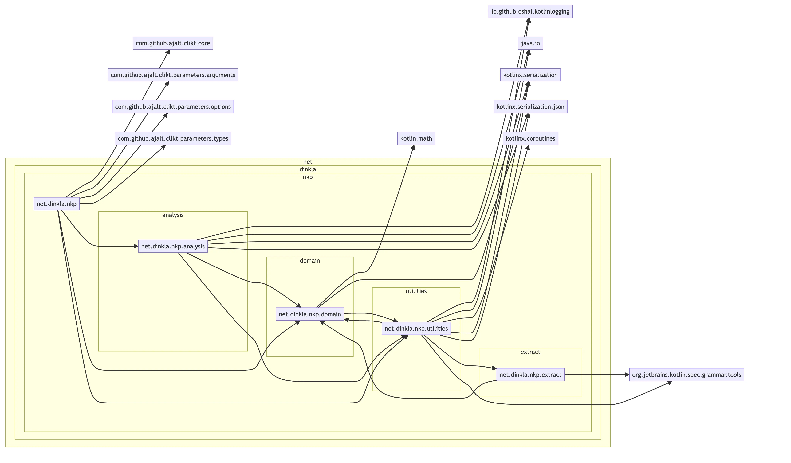

# kotlin-nkp

Kotlin-NKP is a project for static analysis of Kotlin programs (nkp is for aNalysis of Kotlin Programs). 

It can generate some metrics and create diagrams.

**WIP: This project is work in progress. It is at the start of it's life cycle**

## Features

You can run the program with `bin/nkp.sh` or with `just run`.

```shell
$ bin/nkp.sh -h 
Usage: nkp [<options>] <command> [<args>]...

Options:
  -h, --help  Show this message and exit

Commands:
  parse                   Parse a source directory and generate a model file.
  inheritance             Inheritance report
  outliers                Inheritance report
  class-statistics        Class statistics
  file-statistics         File statistics
  package-statistics      File statistics
  mermaid-class-diagram   Inheritance report
  mermaid-import-diagram  Inheritance report
  search                  Inheritance report
  packages                Inheritance report
```

One example is the import flow diagram:



## Installation

- [just](https://github.com/casey/just)
- [ktlint](https://github.com/pinterest/ktlint)

## Usage

The first step is to parse the files in a directory to a json file.

```sh
$ bin/nkp.sh parse /repositories/ray-tracer-challenge/src/main/kotlin generated/model.json
```

Use this JSON file in the analysis steps as input.

```sh
$ bin/nkp.sh mermaid-class-diagram generated/model.json generated/diagram.html
```

or any one of the following

```sh
$ bin/nkp.sh inheritance generated/model.json
```

## Building and Developing

This project uses the following libraries to parse Kotlin source code:

- https://github.com/Kotlin/grammar-tools
- https://github.com/Kotlin/kotlin-spec

You have to build these libraries first locally. 

```sh
$ bin/install-libs.sh
```

### Dependencies

The project uses [refreshVersions](https://splitties.github.io/refreshVersions/)

```sh
$ gradle refreshVersions
```

(c) 2023 - 2025 Jörn Dinkla https://www.dinkla.net
